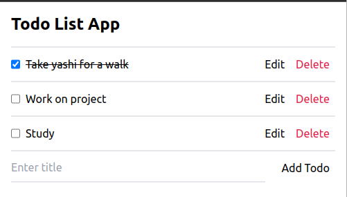

# Todo List App



A simple Todo List Application made with MERN (MongoDB, Express.js, React.js and Node.js) stack along with Tailwind CSS for styling and Notyf for notifications.

## Features

- Add Todos.
- Update Todos.
- Delete Todos.
- Mark Todos as complete.
- Minimalist design made with Tailwind CSS.
- Get notified for different actions.

## Technologies Used

- MongoDB: A NoSQL database used to store todos.
- Express: A web application framework for building backend APIs in Node.js HTTP server.
- React.js: A JavaScript library for building UI.
- Node.js: A JavaScript runtime used to build backend server as well as development setup for React.js.
- TailwindCSS: A utility-first CSS framework used for styling the application.
- Notyf: A JavaScript Library for displaying notifications on the UI.

## Getting Started

### Prerequisites

- Make sure you have Node.js installed on your system. You can download it from https://nodejs.org/
- Make sure you have MongoDB Community Server installed on your system to host the database server on your system. You can download it from https://www.mongodb.com/
  > Alternatively you can use MongoDB Atlas to host the database server on the Cloud. You can set it up from https://www.mongodb.com/atlas/database

### Installation

Clone the repository

```
git clone https://github.com/Kunalpatil22/todo-list-app.git
```

Change into the directory

```
cd todo-list-app
```

Install server dependencies

```
npm install
```

Install client dependencies

```
cd ./client
npm install
```

### Configurations

#### Server Configurations

Create a `.env` file in your root folder and define the following variables.

```
PORT=<your_desired_server_port_number>
MONGODB_URI=<your_mongodb_uri_string>
```

#### Client Configurations

Create a `.env` file in your `client` folder and define the following variable.

```
API_PROXY_URL='http://localhost:5000'
```

> This will ensure that your client will use the above URL for making API requests.

### Start the development server

Change into your root directory and run the following command to start the development server

```
npm run dev
```

## License

The project is licensed under he MIT License - see the [LICENSE](./LICENSE) file for more details.

Feel free to customize and contribute to this README template to provide more information about the Todo List App.
